# prepr
A highly customizible system that allows your class representations (e.g. in `__repr__`), when printed in the terminal, to go from looking like this:


to this:

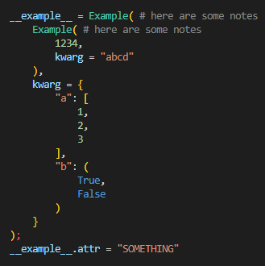
# Install
`pip install prepr`
# Constructing a pretty representation
In order to show how to construct a pretty repr string, we will be using the below example class:
```py
class Example:
    def __init__(self, posarg, kwarg = None):
        self.posarg = posarg
        self.kwarg = kwarg
        self.attr = "something"
```
To start, we create an instance of `prepr` initialized with the class instance:
```py
import prepr

class Example:
    def __repr__(self):
        R = prepr.prepr(self)
```
Then, we start adding positional arguments (of which we have one, `posarg`) by providing the argument value:
```py
class Example:
    def __repr__(self):
        R = prepr.prepr(self)
        R.arg(self.posarg)
```
Next, we start adding our keyword arguments (of which we have one, `kwarg`) by providing a kwarg name and value. Additionally, we can set the `d` (default) optional argument to a value, in which case the kwarg will not be added to the representation if it is equal to that default value:
```py
class Example:
    def __repr__(self):
        R = prepr.prepr(self)
        R.arg(self.posarg)
        R.kwarg("kwarg", self.kwarg, d=None)
```
We can also add attributes that will be displayed after the initial representation. These should only be added for attributes that can change outside of initialization, as displaying attributes that are simply determined by the input variables isn't really necessary (although theres nothing stopping you from adding those attributes too). In the same way as the `kwarg` method, we can provide a default value if wanted:
```py
class Example:
    def __repr__(self):
        R = prepr.prepr(self)
        R.arg(self.posarg)
        R.kwarg("kwarg", self.kwarg, d=None)
        R.attr("attr", self.attr, d="something")
```
Finally, we return the response from the `build` method:
```py
class Example:
    def __repr__(self):
        R = prepr.prepr(self)
        R.arg(self.posarg)
        R.kwarg("kwarg", self.kwarg, d=None)
        R.attr("attr", self.attr, d="something")
        return R.build()
```
A few notes: firstly, each of the addition methods (`arg`, `kwarg`, and `attr`) have convenience methods that can be used to add multiple in a single function call; those are: `args`, `kwargs`, and `attrs`. Second, each of the addition methods returns the class instance, which means you can chain if desired. Below, we will create an instance of our example class, then print it:
```py
import prepr

class Example:
    def __init__(self, posarg, kwarg = None):
        self.posarg = posarg
        self.kwarg = kwarg
        self.attr = "something"
    def __repr__(self):
        return prepr.prepr(self, note="here are some notes").arg(self.posarg).kwarg("kwarg", self.kwarg, d=None).attr("attr", self.attr, d="something").build() # here we also provided a note which will be displayed in the representation, as you will see later

inst = Example("abcd", kwarg=1234)
inst.attr = [1, 2, 3]

print(inst)
```
In our terminal, we get:

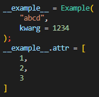
# Changing the global display settings
The display settings are available through the `prepr.settings` class, and allow you to completely change how the representations are created. Settings can be batch-updated with the `settings.update` method, and can be reset to default settings with the `settings.default` method. All of the below examples are using this instance of the `Example` class above:
```py
inst = Example(
    Example(1234, "abcd"),
    {"a": [1, 2, 3],
    "b": (True, False)}
)
```
## Changing the colorspace
The colorspace defines how the representation is displayed in the terminal when printed. There are four main colorspaces available (examples of each are also below):

- `Colorspace.rgbfull` - Full RGB colors that, in my opinion, look the best. The full RGB ANSI syntax is not supported in every terminal, so if it does not work, try one of the others.
- `Colorspace.rgb256` - Uses a 16x16 color pallete instead of full RGB, and is more widely supported.
- `Colorspace.rgb8` - A colorspace that uses the 8 widely supported ANSI color codes (30 through 37). This colorspace has the most support.
- `Colorspace.none` - No terminal formatting codes will be applied to the representation. Also useful if the text from the representation will be used elsewhere instead of being printed, in which case the raw text would most likely be desired over the text filled with color codes.

Setting the global colorspace is quite easy. All you need to do is set `settings.csh` to a `CSHandler` instance initialized with a valid `Colorspace`; example below:
```py
import prepr
prepr.settings.csh = prepr.CSHandler(prepr.Colorspace.rgb8)
```

Additionally, you can create a custom colorspace by using the `Colorspace.custom` class. Examples of each of these colorspaces (and their implementations) are below:
### `Colorspace.rgbfull`
By default, the `rgbfull` colorspace is used.
```py
print(inst)
```

### `Colorspace.rgb256`
```py
import prepr
prepr.settings.csh = prepr.CSHandler(prepr.Colorspace.rgb256)
print(inst)
```
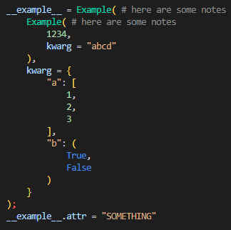
### `Colorspace.rgb8`
```py
import prepr
prepr.settings.csh = prepr.CSHandler(prepr.Colorspace.rgb8)
print(inst)
```
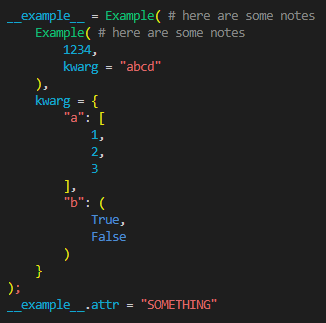
### `Colorspace.none`
```py
import prepr
prepr.settings.csh = prepr.CSHandler(prepr.Colorspace.none)
print(inst)
```
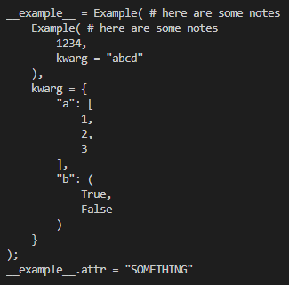
## Custom indent
A custom indent can be set by assigning `settings.indent` a `str` (which by default is four whitespaces):
```py
import prepr
prepr.settings.indent = "  "
print(inst)
```
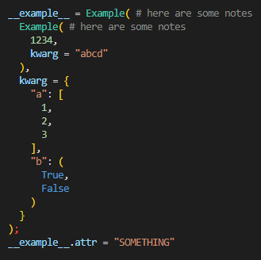
## Custom line break
A custom line break can be set by assigning `settings.line_break` a `str` (which by default is `"\n"`):
```py
import prepr
prepr.settings.indent = " " # just so the repr isn't too obnoxious, given the default is four whitespaces
prepr.settings.line_break = ""
print(inst)
```
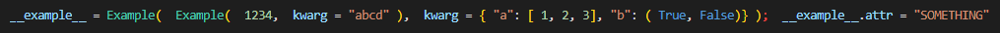
## Force lists, tuples and/or dicts to be collapsed
By default, lists, tuples and dicts are fully expanded. You can force them to be collapsed with the `settings.force_lists_collapsed`, `settings.force_tuples_collapsed`, and `settings.force_dicts_collapsed` settings. For example:
```py
import prepr
prepr.settings.force_lists_collapsed = True
print(inst)
```
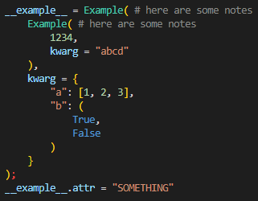
```py
import prepr
prepr.settings.force_tuples_collapsed = True
print(inst)
```
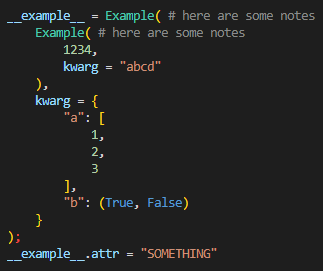

Any objects within the list/tuple/dict (if set to be collapsed) will also be collapsed. For example:

```py
import prepr
prepr.settings.force_dicts_collapsed = True
print(inst)
```
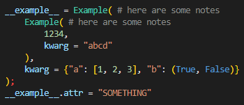
## Other notes
In addition to the `settings.default` preset method, there is a `settings.minimal` method, which will force the entire representation into one line with as little spacing as possible. For example:
```py
import prepr
prepr.settings.minimal()
print(inst)
```
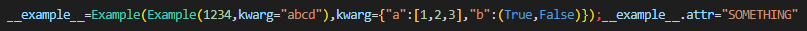